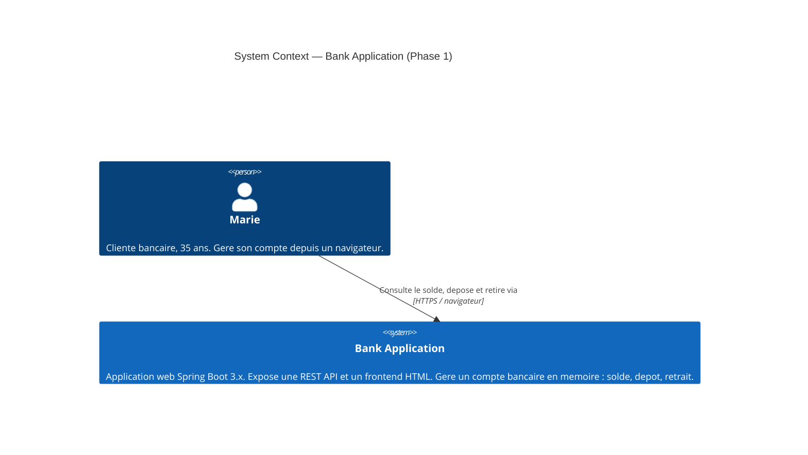
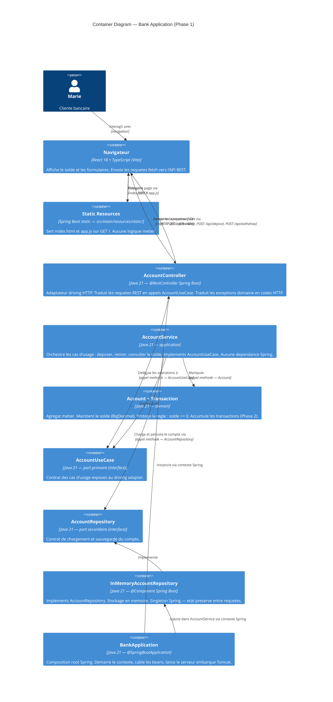
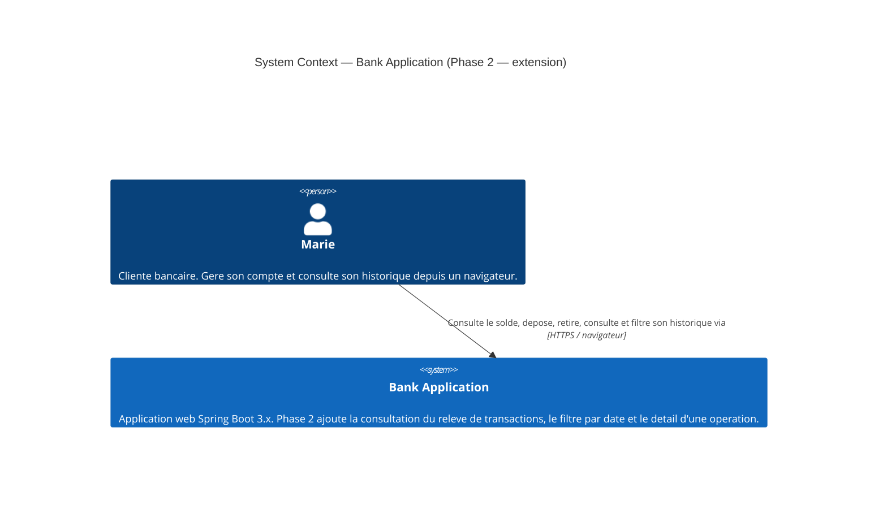
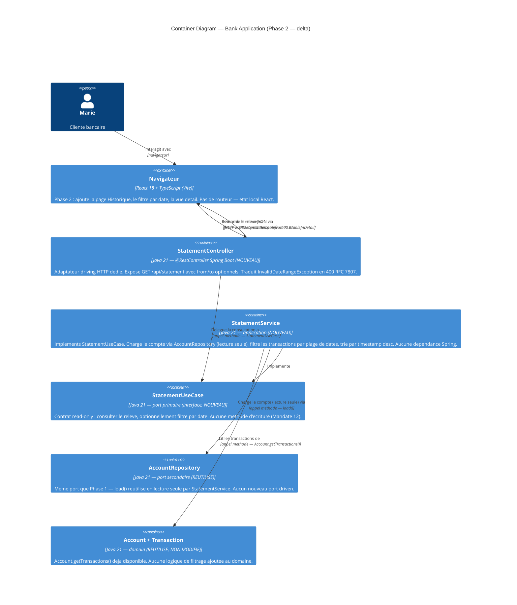

# Architecture Brief — Bank Application

**Projet** : Bank Application — Software Crafts Romandie  
**Date** : 2026-06-02  
**Architecte** : Morgan (solution-architect nWave)  
**Statut** : Approuvé — prêt pour DISTILL wave

---

## Application Architecture

> **Pivot 2026-06-02** : La section ci-dessous remplace l'architecture CLI kata. Le projet est
> désormais une application web bancaire standard. Les décisions CLIAdapter et "Java pur sans
> framework" sont remplacées par Spring Boot 3.x et AccountController (@RestController).

---

### Contexte système

La Bank Application est une application web bancaire standard. Marie, cliente bancaire grand
public, interagit depuis son navigateur pour consulter son solde, effectuer des dépôts et des
retraits. Le backend expose une REST API (Spring Boot 3.x) consommée par un frontend React 18
servi par le même serveur. Il n'y a aucune dépendance externe (pas de base de données
Phase 1, pas d'API tierce). Le compte est maintenu en mémoire (in-process, singleton Spring).

---

### Attributs de qualité prioritaires

| Attribut | Priorité | Justification |
|----------|----------|---------------|
| Testabilité | Critique | Isolation domaine / HTTP — le domaine doit être testable sans Spring ; l'API REST testable via MockMvc sans serveur complet |
| Maintenabilité | Élevée | Phase 2 ajoutera l'historique des transactions sans toucher le domaine ni l'API actuelle |
| Time-to-market | Élevée | Stack standard Spring Boot — outillage, documentation, exemples abondants |
| Sécurité | Non critique (Phase 1) | Pas d'authentification en Phase 1 — décision explicite documentée dans ADR-003 |
| Performance | Non critique | Application mono-utilisateur en mémoire — latence imperceptible |

---

### Diagramme C4 — Niveau 1 : System Context



---

### Diagramme C4 — Niveau 2 : Container



---

### Architecture retenue : Hexagonal (Ports & Adapters) + OOP + Spring Boot

**Justification** : L'architecture Hexagonale est confirmée et renforcée par le pivot web.
Le risque de pollution Spring dans le domaine (annotations `@Autowired`, `@Component` dans
`domain/`) est plus élevé avec Spring Boot qu'avec Java pur — c'est précisément pourquoi
la règle de dépendance hexagonale et l'enforcement ArchUnit deviennent critiques.

**Règle de dépendance** : toutes les dépendances pointent vers l'intérieur.
- `AccountController` (@RestController) → `AccountUseCase` (port primaire)
- `AccountService` → `AccountRepository` (port secondaire)
- `InMemoryAccountRepository` (@Component) implémente `AccountRepository`
- `Account` et `Transaction` ne dépendent d'aucun port, d'aucun adaptateur, d'aucune classe Spring
- Le package `domain` n'importe **jamais** `org.springframework.*`

---

### Decomposition des composants

| Composant | Couche | Responsabilité unique |
|-----------|--------|-----------------------|
| `Account` | domain | Agrégat — maintient le solde (`BigDecimal`), valide les opérations, lève `InsufficientFundsException`, accumule les transactions |
| `Transaction` | domain | Value object (Java Record) — type (DEPOSIT/WITHDRAWAL) + montant + horodatage |
| `InsufficientFundsException` | domain | Exception métier non-checked — signal de violation de règle domaine |
| `AccountUseCase` | application/port/in | Port primaire (interface driving) — contrat des cas d'usage exposés au controller HTTP |
| `AccountRepository` | application/port/out | Port secondaire (interface driven) — contrat de chargement/sauvegarde du compte |
| `AccountService` | application | Implémentation de `AccountUseCase` — orchestre domain + port secondaire — aucune dépendance Spring |
| `AccountController` | adapter/in/web | Adaptateur driving HTTP (@RestController) — traduit REST en appels `AccountUseCase`, traduit exceptions domaine en codes HTTP |
| `DepositRequest` | adapter/in/web | DTO entrant (Java Record) — montant du dépôt |
| `WithdrawRequest` | adapter/in/web | DTO entrant (Java Record) — montant du retrait |
| `BalanceResponse` | adapter/in/web | DTO sortant (Java Record) — solde courant formaté |
| `InMemoryAccountRepository` | adapter/out | Adaptateur driven (@Component, singleton Spring) — implémente `AccountRepository` en mémoire |
| `BankApplication` | composition root | @SpringBootApplication — démarre le contexte Spring, câble les beans |
| `frontend/` (build → `static/`) | static resources | Projet Vite + React 18 + TypeScript — `api/bankApi.ts`, `BalanceDisplay`, `OperationForm`, `App`. Tests Vitest + RTL. Build Maven → `src/main/resources/static/` |

---

### Ports driving (primaires)

**`AccountUseCase`** — interface Java, couche `application/port/in`

Contrat comportemental (sans signature de méthode — HOW appartient au crafter) :
- Déposer un montant positif sur le compte → met à jour le solde
- Retirer un montant positif si les fonds sont suffisants → met à jour le solde, ou signale l'insuffisance
- Consulter le solde courant → retourne la valeur actuelle sans la modifier

**`AccountController`** (@RestController) — adaptateur driving HTTP, couche `adapter/in/web`

Endpoints REST exposés :
- `GET /api/balance` → consulter le solde courant
- `POST /api/deposit` → déposer un montant (`DepositRequest` body JSON)
- `POST /api/withdraw` → retirer un montant (`WithdrawRequest` body JSON)

Codes HTTP :
- `200 OK` — opération réussie
- `400 Bad Request` — montant invalide (<= 0 ou non numérique)
- `409 Conflict` — fonds insuffisants (traduit depuis `InsufficientFundsException` domaine)

---

### Ports driven (secondaires)

**`AccountRepository`** — interface Java, couche `application/port/out`

Contrat comportemental :
- Charger le compte courant (unique pour la Phase 1)
- Sauvegarder l'état du compte après chaque opération

**`InMemoryAccountRepository`** — adaptateur driven, couche `adapter/out`

Annoté `@Component` Spring Boot : singleton géré par le conteneur IoC. L'état du compte est
préservé entre les requêtes HTTP pour la durée de vie du processus. Redémarrer le serveur remet
le solde à zéro (comportement documenté en Phase 1).

**Probe du port driven** (principe Earned Trust) :
L'`InMemoryAccountRepository` expose une méthode `probe()` exécutée au démarrage via
`ApplicationRunner` Spring. La probe valide : création d'un compte en mémoire, chargement,
mutation, rechargement cohérent. Échec → le contexte Spring refuse de démarrer avec un événement
structuré `health.startup.refused`. Justification : même un adaptateur en mémoire peut régresser
entre refactors ; la probe détecte les ruptures de contrat avant toute requête HTTP.

---

### Structure des packages Java

```
src/
  main/java/
    com/softcrafts/bankkata/
      domain/
        Account.java                    (agregat)
        Transaction.java                (value object — record Java)
        InsufficientFundsException.java (exception metier)
      application/
        port/
          in/  AccountUseCase.java      (port primaire — interface)
          out/ AccountRepository.java   (port secondaire — interface)
        AccountService.java             (implementation AccountUseCase — aucune dependance Spring)
      adapter/
        in/
          web/
            AccountController.java      (@RestController)
            DepositRequest.java         (record — DTO entrant)
            WithdrawRequest.java        (record — DTO entrant)
            BalanceResponse.java        (record — DTO sortant)
        out/
          InMemoryAccountRepository.java  (@Component — singleton Spring)
      BankApplication.java              (@SpringBootApplication — remplace Main)
  main/resources/
    static/
      index.html                        (frontend HTML vanilla)
      app.js                            (fetch API — consomme REST)
  test/java/
    com/softcrafts/bankkata/
      domain/
        AccountTest.java
      application/
        AccountServiceTest.java
      adapter/
        in/web/
          AccountControllerTest.java    (MockMvc — sans serveur complet)
        out/
          InMemoryAccountRepositoryTest.java
```

---

### Stack technologique

| Composant | Choix | Version | Licence | Justification |
|-----------|-------|---------|---------|---------------|
| Runtime | Java | 21 LTS | GPL v2 + Classpath Exception | Inchangé — LTS jusqu'à 2031, Records natifs |
| Framework web | Spring Boot | 3.x | Apache 2.0 | Standard industrie, REST natif (@RestController), injection de dépendances (composition root Spring), Tomcat embarqué |
| Tests REST | MockMvc | Spring Boot Starter Test | Apache 2.0 | Tests d'intégration REST sans démarrer un serveur complet — isolation HTTP rapide |
| Tests unitaires | JUnit 5 | 5.x | EPL 2.0 | Standard de facto Java |
| Assertions | AssertJ | 3.x | Apache 2.0 | Assertions fluides |
| Mocking | Mockito | 5.x | MIT | Isolation des ports driven pour tests unitaires |
| Build | Maven ou Gradle | dernière stable | Apache 2.0 | Standard Java — choix laissé au crafter |
| Frontend | React 18 + TypeScript | Vite 5.x | MIT | Standard industriel — projet `frontend/` autonome, proxy dev → :8080, build produit dans `src/main/resources/static/`, tests Vitest + RTL |
| Enforcement architectural | ArchUnit | 1.x | Apache 2.0 | Vérifie les règles de dépendance hexagonale ET l'absence d'imports Spring dans le domaine |

**Intégrations externes** : aucune — pas d'annotation de contract testing requise.

---

### Enforcement architectural (ArchUnit)

Règles à encoder en CI via ArchUnit :
1. Les classes du package `domain` n'importent aucune classe des packages `application`, `adapter`
2. Les classes du package `domain` n'importent **aucune** classe `org.springframework.*` (guardrail pivot)
3. Les classes du package `application` n'importent aucune classe du package `adapter`
4. Les classes du package `application` n'importent aucune classe `org.springframework.*`
5. Seul `BankApplication` (composition root) est annoté `@SpringBootApplication`
6. Les classes `@RestController` appartiennent uniquement au package `adapter.in.web`

---

### Analyse de réutilisation (Reuse Analysis)

| Composant existant (CLI original) | Fichier | Overlap | Decision | Justification |
|---|---|---|---|---|
| `Account` | `domain/Account.java` | Logique domaine | REUSE AS-IS | La règle "solde >= 0" est indépendante du transport |
| `Transaction` | `domain/Transaction.java` | Value object | REUSE AS-IS | Record immuable, indépendant du transport |
| `InsufficientFundsException` | `domain/` | Exception domaine | REUSE AS-IS | Exception métier pure |
| `AccountUseCase` | `application/port/in/` | Port primaire | REUSE AS-IS | Spring Boot injecte l'implémentation via l'interface |
| `AccountRepository` | `application/port/out/` | Port secondaire | REUSE AS-IS | Interface indépendante du framework |
| `AccountService` | `application/` | Orchestration | REUSE AS-IS | Aucune dépendance CLI ni Spring dans le service |
| `InMemoryAccountRepository` | `adapter/out/` | Stockage mémoire | EXTEND (bean Spring) | Ajouter `@Component` pour l'injection Spring, singleton géré par le conteneur |
| `CLIAdapter` | `adapter/in/` | Driving port CLI | **REMOVE** | Remplacé par `AccountController` (@RestController) |
| `Main` | `Main.java` | Point d'entrée | **REPLACE** | `@SpringBootApplication` remplace le `main()` manuel |
| `AccountController` | `adapter/in/web/` | Driving port HTTP | CREATE NEW | Nouveau composant — pas d'équivalent dans le CLI original |
| `DepositRequest` | `adapter/in/web/` | DTO entrant | CREATE NEW | Nouveau — spécifique au transport HTTP |
| `WithdrawRequest` | `adapter/in/web/` | DTO entrant | CREATE NEW | Nouveau — spécifique au transport HTTP |
| `BalanceResponse` | `adapter/in/web/` | DTO sortant | CREATE NEW | Nouveau — spécifique au transport HTTP |
| `index.html` + `app.js` | `resources/static/` | Frontend | CREATE NEW | Nouveau — interface utilisateur web |

---

### Stratégie de qualité (ISO 25010)

| Attribut | Stratégie |
|----------|-----------|
| Testabilité | Domaine testable sans Spring (aucune annotation) ; API REST testable via MockMvc sans démarrer Tomcat ; ports driving/driven permettent le mock de tout adaptateur |
| Maintenabilité | Phase 2 ajoute `StatementService` et un endpoint `/api/statement` sans modifier `Account`, `AccountService` ni `AccountController` |
| Fiabilité | `InsufficientFundsException` = signal explicite non-checked — aucun état corrompu possible ; probe au démarrage détecte les régressions de l'adaptateur mémoire |
| Sécurité | Pas d'authentification Phase 1 (décision explicite ADR-003) — aucune donnée persistée |
| Utilisabilité | Feedback immédiat après chaque opération (confirmation + solde mis à jour inline) — confirmé dans le JTBD DISCUSS |

---

### Questions ouvertes — Pour DISTILL / DELIVER

| # | Question | Impacte |
|---|----------|---------|
| Q1 | Format JSON des réponses d'erreur (RFC 7807 Problem Details ?) | Contrat API frontend/backend — doit être stable avant implémentation |
| Q2 | Code HTTP pour fonds insuffisants (409 Conflict vs 422 Unprocessable Entity) | Sémantique REST — confirmé 409 dans le DISCUSS, à valider en DISTILL |
| Q3 | Sérialisation BigDecimal en JSON (String vs Number) | Cohérence frontend/backend — `"150.00"` vs `150.00` |
| Q4 | CORS si frontend servi sur un port différent | Hors scope Phase 1 — Spring Boot sert le HTML depuis static resources |
| Q5 | Authentification et gestion des sessions | Hors scope Phase 1 — à traiter en Phase 3 |

---

### ADRs associés

| ADR | Titre | Statut |
|-----|-------|--------|
| [ADR-001](adr-001-hexagonal-oop.md) | Architecture Hexagonale + OOP | Accepté — confirmé et renforcé (pivot web) |
| [ADR-002](adr-002-java21.md) | Java 21 LTS | Accepté — inchangé |
| [ADR-003](adr-003-spring-boot.md) | Spring Boot 3.x comme framework web | Accepté — nouveau (pivot 2026-06-02) |
| [ADR-004](adr-004-statement-read-side-extension.md) | Extension additive read-side — `StatementUseCase` séparé | Accepté — nouveau (Phase 2, 2026-06-16) |
| [ADR-005](adr-005-backend-pagination-sorting.md) | Pagination et tri backend — DTO custom `PageResponse<T>` | Accepté — nouveau (Phase 2, amendement 2026-06-16, supersède D8) |

---

## Application Architecture — Phase 2 (Transaction History)

**Date** : 2026-06-16
**Statut** : Proposé — mode "propose", décisions verrouillées par DISCUSS + options présentées où un vrai choix existe.

### Périmètre

Extension additive stricte du contexte Account/Transaction existant. Zéro modification de
`Account`, `Transaction`, `AccountUseCase`, `AccountService`, `AccountRepository`,
`AccountController`, `InMemoryAccountRepository`. 3 slices : relevé complet (WS) → filtre par
date (Release 1) → détail transaction (Release 2, pur frontend, zéro nouvel endpoint).

### Diagramme C4 — Niveau 1 : System Context (delta)

Inchangé dans sa structure — Marie interagit toujours avec un seul système. Note d'extension :



### Diagramme C4 — Niveau 2 : Container (delta Phase 2)

Vue delta — composants Phase 1 grisés conceptuellement (déjà documentés ci-dessus), focus sur
les nouveaux composants et leurs relations avec l'existant.



### Décisions de conception (table — [REF] Tier-1)

| # | Décision | Statut | Choix retenu | Rationale court |
|---|----------|--------|---------------|------------------|
| D1 | Localisation du nouvel endpoint | Verrouillé DISCUSS | Nouveau `StatementController` dédié (`adapter/in/web`) | `AccountController` ne doit pas être touché (contrainte additive stricte) ; SRP — un controller par cas d'usage cohérent |
| D2 | Nouveau port driving ? | Proposé → Retenu | Nouveau `StatementUseCase` séparé de `AccountUseCase` | Cohésion : `AccountUseCase` = écriture/lecture solde ; `StatementUseCase` = lecture pure historique. Évite de polluer un port stable Phase 1 |
| D3 | Accès aux transactions sans nouveau port driven | Proposé → Retenu | Réutilisation de `AccountRepository.load()` existant, lecture seule | Le port expose déjà `Account` complet (incluant `getTransactions()`) ; créer un second port driven dupliquerait l'accès au même agrégat sans bénéfice |
| D4 | Localisation du filtrage par date | Verrouillé DISCUSS, confirmé | Couche application (`StatementService`), jamais domaine | Le domaine ne doit pas connaître les query params HTTP (`from`/`to` sont un concept de transport/présentation, pas une règle métier) |
| D5 | Gestion erreur `from > to` | Proposé → Retenu | Exception dédiée `InvalidDateRangeException` + `@ExceptionHandler` local au `StatementController` | Distinction sémantique de `IllegalArgumentException` (montant invalide, Phase 1) : la plage de dates n'est pas un montant — réutiliser le même type masquerait l'intention et risquerait un faux-positif de handler partagé |
| D6 | Bornes temporelles `from`/`to` (assumption A2 DISCUSS) | Confirmé DESIGN | `from` → `00:00:00.000Z` ; `to` → `23:59:59.999Z` (UTC, jour calendaire complet) | Cohérent avec `Transaction.timestamp` en `Instant` UTC ; pas de notion de fuseau utilisateur dans le périmètre (mono-utilisateur, pas d'auth) — voir `## Changed Assumptions` |
| D7 | Frontend — routage | Verrouillé DISCUSS (cohérence existante) | Pas de nouvelle dépendance (pas de react-router) — état local `useState` + rendu conditionnel | App.tsx Phase 1 n'a aucun routeur ; introduire react-router pour 2 vues (compte / historique / détail) serait disproportionné — cf. principe "simplest solution first" |
| D8 | Pagination | **SUPERSEDED par D10 / ADR-005** (2026-06-16, amendement) | ~~Aucune pagination~~ — voir D10 | Décision correcte pour le périmètre connu à l'itération 1 (mono-utilisateur, volumes faibles) ; supersédée suite à une exigence produit explicite post-review (pagination backend demandée), pas une invalidation technique rétroactive |
| D9 | Format JSON montants (assumption A1 DISCUSS) | Corrigé DESIGN | **Number natif** (pas String) | `BalanceResponse` Phase 1 sérialise déjà `BigDecimal` en Number sans config Jackson — A1 du DISCUSS était erronée. `TransactionResponse.amount` suit la même convention pour cohérence API | 
| D10 | Pagination backend (amendement) | Verrouillé produit (style DTO proposé → retenu) | DTO custom `PageResponse<T>`, pas Spring Data `Pageable`/`Page` | Exigence produit explicite "pagination provenant du backend" ; `Pageable`/`Page` nécessiteraient `spring-data-commons`, absent du projet — voir ADR-005 |
| D11 | Ordre filtre/tri/pagination | Proposé → Retenu | Filtre (slice-06) → Tri → Pagination, dans cet ordre strict | Seul ordre qui garantit `totalElements`/`totalPages` cohérents avec le filtre actif ; tri avant pagination pour que la page N reflète l'ordre global, pas un tri par page |
| D12 | Comportement page hors limites | Proposé → Retenu | 200 OK, `content: []`, métadonnées cohérentes (pas 400) | Cohérent avec le principe déjà établi "jamais d'erreur pour une absence de résultat" (slice-05/06) — voir ADR-005 |
| D13 | Validation de `size` | Proposé → Retenu | Whitelist stricte `{10, 20, 50}` → 400 si hors liste | Le product owner a fixé une liste fermée, pas un plafond ouvert ; un 400 explicite évite la dérive silencieuse (cohérent avec le traitement déjà établi de `from > to`) — voir ADR-005 |

### Component decomposition (nouveaux composants)

| Composant | Couche | Responsabilité unique |
|-----------|--------|------------------------|
| `StatementUseCase` | application/port/in | Port primaire driving, **read-only** — contrat : consulter le relevé (optionnellement filtré par plage de dates). Aucune méthode d'écriture exposée (séparation lecture/écriture — Mandate 12) |
| `StatementService` | application | Implémente `StatementUseCase` — charge le compte via `AccountRepository.load()`, filtre les transactions par plage `[from, to]` (bornes inclusives), trie par `timestamp` décroissant. Aucune dépendance Spring |
| `InvalidDateRangeException` | application (ou domain-adjacent utilitaire applicatif) | Exception non-checked — signale `from > to`. Levée par `StatementService`, jamais par le domaine |
| `StatementController` | adapter/in/web | Adaptateur driving HTTP (@RestController) dédié — `GET /api/statement`, parse `from`/`to` (ISO 8601 `yyyy-MM-dd`), délègue à `StatementUseCase`, traduit `InvalidDateRangeException` en 400 RFC 7807 |
| `TransactionResponse` | adapter/in/web | DTO sortant (record) — une transaction sérialisée : `type` (String enum), `amount` (Number/BigDecimal), `timestamp` (String ISO-8601 `Instant`) |
| `StatementResponse` | adapter/in/web | DTO sortant (record) — enveloppe `List<TransactionResponse>` triée desc. État vide = liste vide, jamais `null` |
| `StatementPage` (frontend) | `frontend/src/components/StatementPage/` | Composant React — orchestre chargement du relevé, filtre de dates, tableau, vue détail (rendu conditionnel local) |
| `DateRangeFilter` (frontend) | `frontend/src/components/DateRangeFilter/` | Composant React — 2 champs date + bouton Appliquer, validation locale `from > to` avant envoi |
| `TransactionList` (frontend) | `frontend/src/components/TransactionList/` | Composant React — tableau des transactions ou état vide explicite, clic ligne → sélection détail |
| `TransactionDetail` (frontend) | `frontend/src/components/TransactionDetail/` | Composant React — vue détail d'une transaction sélectionnée (type, montant, date/heure complète), bouton retour préservant le filtre actif |

### Driving port — `StatementUseCase`

Contrat comportemental (sans signature de méthode — HOW appartient au crafter) :
- Consulter le relevé complet des transactions, trié du plus récent au plus ancien
- Consulter le relevé restreint à une plage de dates `[from, to]` (bornes inclusives), même tri
- Aucune méthode de mutation — port strictement read-only (séparation des ports driving lecture/écriture, Mandate 12 : `AccountUseCase` reste le seul port d'écriture)

**Contract shape** : pure read / bounded-change — `StatementService` ne mute jamais `Account`
(appelle uniquement `AccountRepository.load()`, jamais `save()`). Univers de l'agrégat : un seul
`Account` in-memory (mono-utilisateur). Mécanisme d'assertion attendu côté crafter : test
applicatif vérifiant qu'aucun appel à `AccountRepository.save()` n'a lieu lors d'une consultation
(mock `AccountRepository`, `verify(never()).save(any())`).

### Driven port — réutilisation de `AccountRepository`

Aucun nouveau port driven. `StatementService` dépend de `AccountRepository` (port existant,
`application/port/out`) et n'invoque que `load()`. Pas d'invocation de `save()` — usage en lecture
seule d'un port qui expose aussi l'écriture (le port lui-même n'est pas split, car
`InMemoryAccountRepository` reste l'unique adaptateur et red-classer le port casserait
`AccountService` Phase 1 sans bénéfice ; le respect du contrat read-only est assuré par
discipline du nouveau service + test de non-régression, pas par le type system à ce niveau).

### Gestion d'erreur — `GET /api/statement`

| Cas | Code HTTP | Corps |
|-----|-----------|-------|
| Relevé complet ou filtré, avec ou sans résultat | 200 OK | `StatementResponse` (liste vide si aucune transaction) |
| `from` > `to` | 400 Bad Request | `ProblemDetail` (RFC 7807) — pattern identique à `AccountController`, handler local à `StatementController` |
| `from`/`to` non parseable (format invalide) | 400 Bad Request | `ProblemDetail` — `DateTimeParseException` mappée par le même pattern |

### Mapping domaine → DTO

`Transaction` (record domaine : `Type type`, `BigDecimal amount`, `Instant timestamp`) →
`TransactionResponse` :

| Champ DTO | Source domaine | Format JSON |
|-----------|-----------------|-------------|
| `type` | `Transaction.type()` | String — `"DEPOSIT"` / `"WITHDRAWAL"` (sérialisation native de l'enum) |
| `amount` | `Transaction.amount()` | Number natif (BigDecimal, cohérent avec `BalanceResponse` Phase 1) |
| `timestamp` | `Transaction.timestamp()` | String ISO-8601 (sérialisation native de `Instant` par Jackson) |

Le mapping est effectué dans `StatementController` (ou une méthode statique de fabrique du DTO) —
pas dans `StatementService`, qui retourne des `Transaction` (domaine) à l'adaptateur. Le service
applicatif ne connaît aucun type HTTP/DTO.

### Frontend — composants et état (sans router)

- **Navigation** : `App.tsx` garde un état racine (`useState<'account' | 'statement'>`) qui
  bascule l'affichage entre la page compte (Phase 1, inchangée) et `StatementPage` (Phase 2,
  nouveau). Aucune dépendance npm ajoutée (pas de `react-router-dom`) — cohérent avec
  l'absence de routeur Phase 1 et le principe "simplest solution first".
- **`StatementPage`** : état local — `transactions: TransactionResponse[]`, `dateRange: {from, to} | null`, `selectedTransaction: TransactionResponse | null`. Charge `GET /api/statement` au montage et à chaque application de filtre. Le retour du détail vers le relevé préserve `dateRange` (pas de re-fetch, juste masquage de la vue détail).
- **`DateRangeFilter`** : validation locale `from > to` → désactive le bouton "Appliquer" et affiche un message, sans appel réseau (cohérence avec la validation serveur D5/D6, mais évite un aller-retour réseau inutile).
- **`TransactionList`** : état vide explicite (message dédié) si la liste reçue est vide — distingue visuellement "aucune transaction jamais" (relevé complet vide) de "aucune transaction sur la période" (filtre actif vide), réutilisant `dateRange` pour le libellé.
- **`TransactionDetail`** : pur affichage des données déjà en mémoire côté client (aucun fetch) — conforme à l'Alternative 3 rejetée du DISCUSS (pas d'endpoint dédié).

### Stack technologique — Phase 2 (delta)

Aucun ajout. Réutilisation stricte de la stack Phase 1 (Java 21, Spring Boot 3.x, JUnit 5,
AssertJ, Mockito, ArchUnit, React 18 + TypeScript + Vite). Aucune nouvelle dépendance OSS
introduite — confirmé par D7 (pas de router) et D8 (pas de pagination, donc pas de bibliothèque
de pagination/virtualisation).

### Intégrations externes

Aucune. Pas d'annotation de contract testing requise pour Phase 2 (inchangé depuis Phase 1).

### Enforcement architectural (ArchUnit) — Phase 2

Aucune nouvelle règle structurelle requise : les règles existantes (`ArchitectureTest.java`)
couvrent déjà `StatementController` (package `adapter.in.web`), `StatementService` et
`StatementUseCase` (packages `application`/`application.port.in`) sans modification. Vérification
post-implémentation recommandée au crafter : confirmer que `StatementService` n'importe aucune
classe `adapter.*` et que `StatementController` est bien le seul point d'entrée HTTP du nouveau
sous-système.

### Reuse Analysis (Phase 2) — HARD GATE

| Composant existant | Fichier | Overlap avec Phase 2 | Décision | Justification | Contract shape (si applicable) |
|---|---|---|---|---|---|
| `Account` | `domain/Account.java` | `getTransactions()` consommé en lecture | REUSE AS-IS | Méthode déjà publique, liste non modifiable — aucune extension nécessaire | bounded-change (déjà — inchangé) |
| `Transaction` | `domain/Transaction.java` | Source du mapping DTO | REUSE AS-IS | Record stable, aucun champ supplémentaire requis par les 3 slices | pure-value (record immuable) |
| `AccountUseCase` | `application/port/in/AccountUseCase.java` | Aucun — périmètre disjoint (écriture solde) | REUSE AS-IS (non touché) | Contrainte DISCUSS stricte — aucune méthode statement ajoutée à ce port | n/a — port écriture, hors périmètre lecture |
| `AccountRepository` | `application/port/out/AccountRepository.java` | `load()` réutilisé par `StatementService` | REUSE AS-IS, usage étendu (lecture seule) | Port déjà suffisant — `Account` chargé expose `getTransactions()` ; pas de nouveau port driven nécessaire | bounded-change — `StatementService` n'invoque jamais `save()` ; assertion via mock `verify(never()).save(any())` côté test crafter |
| `AccountController` | `adapter/in/web/AccountController.java` | Aucun — endpoints disjoints | REUSE AS-IS (non touché) | Contrainte DISCUSS stricte — nouveau controller dédié, voir D1 | n/a |
| `AccountService` | `application/AccountService.java` | Aucun — cas d'usage disjoints | REUSE AS-IS (non touché) | `StatementService` est un nouveau service parallèle, pas une extension de `AccountService` | n/a |
| `BalanceResponse` | `adapter/in/web/BalanceResponse.java` | Pattern de sérialisation Number | REUSE AS PATTERN (pas de code partagé) | Confirme que Number est la convention native Jackson pour `BigDecimal` — `TransactionResponse.amount` suit le même pattern, corrige A1 | n/a |
| `App.tsx` | `frontend/src/App.tsx` | Composant racine, état local | EXTEND | Ajout d'un état de navigation (`'account' \| 'statement'`) et d'un lien "Voir l'historique" — pas de remplacement, pas de router ajouté | n/a (UI) |
| `bankApi.ts` | `frontend/src/api/bankApi.ts` | Pattern fetch + `handleResponse<T>` générique | EXTEND | Ajouter une fonction `getStatement(from?, to?)` réutilisant `handleResponse<T>` existant — même gestion d'erreur `ApiError` | n/a (UI) |
| `types/index.ts` | `frontend/src/types/index.ts` | Interfaces TS partagées | EXTEND | Ajouter `TransactionResponse`, `StatementResponse` — `ApiError` réutilisé sans modification | n/a (UI) |
| `BalanceDisplay` | `frontend/src/components/BalanceDisplay/` | Aucun — composant disjoint | REUSE AS-IS (non touché) | Reste sur la page compte Phase 1, aucune dépendance vers l'historique | n/a |
| `OperationForm` | `frontend/src/components/OperationForm/` | Aucun — composant disjoint | REUSE AS-IS (non touché) | Reste sur la page compte Phase 1 | n/a |
| `StatementUseCase` | `application/port/in/` (nouveau) | — | CREATE NEW | Aucun port existant n'exprime un contrat read-only sur l'historique — `AccountUseCase` est écriture-orientée et ne doit pas être étendu (contrainte additive) | pure read (port sans méthode de mutation) |
| `StatementService` | `application/` (nouveau) | — | CREATE NEW | Aucun service existant n'orchestre le filtrage par date — logique applicative nouvelle, ne peut vivre dans le domaine (D4) | bounded-change (lecture seule sur `AccountRepository`) |
| `InvalidDateRangeException` | `application/` (nouveau) | — | CREATE NEW | Sémantique distincte de `IllegalArgumentException` (montant invalide) — voir D5 | n/a (exception) |
| `StatementController` | `adapter/in/web/` (nouveau) | — | CREATE NEW | Nouveau endpoint, contrainte DISCUSS d'isolation de `AccountController` (D1) | n/a |
| `TransactionResponse` | `adapter/in/web/` (nouveau) | — | CREATE NEW | DTO spécifique au transport HTTP du relevé | pure-value (record) |
| `StatementResponse` | `adapter/in/web/` (nouveau) | — | CREATE NEW | Enveloppe de liste, spécifique au transport HTTP | pure-value (record) |
| `StatementPage`, `DateRangeFilter`, `TransactionList`, `TransactionDetail` | `frontend/src/components/` (nouveaux) | — | CREATE NEW | Aucun composant Phase 1 ne couvre tableau/filtre/détail d'historique | n/a (UI) |

### Probe — Earned Trust (Phase 2)

`StatementService` dépend uniquement d'`AccountRepository`, déjà probé au démarrage par
`InMemoryAccountRepository.probe()` (documenté en Phase 1, inchangé). Aucun nouveau driven
adapter introduit en Phase 2 → aucune nouvelle probe de démarrage nécessaire. Le risque
résiduel (lecture incohérente après filtrage) est couvert par test applicatif, pas par une probe
d'infrastructure — `StatementService` ne traverse aucune frontière non fiable (pas de filesystem,
pas de réseau, pas de SDK tiers).

### Pagination et tri — Amendement Phase 2

**Date** : 2026-06-16 (amendement post-peer-review de l'itération DESIGN 1)
**Statut** : Proposé — mode "propose", exigence produit verrouillée sur le besoin (pagination
backend), options présentées sur le COMMENT (style API, comportement page hors limites,
validation `size`).
**Supersède** : D8 (voir table des décisions ci-dessus et ADR-005 pour le détail complet)

Cette sous-section amende — sans réécrire — l'architecture Phase 2 ci-dessus. Tout le contenu
précédent (C4, component decomposition, ADR-004, reuse analysis initiale) reste valide ; seul
le contrat de `GET /api/statement` et les composants `StatementService`/`StatementController`/
frontend liés à l'historique sont étendus.

#### Contexte du changement

Le product owner a explicitement demandé, après l'approbation de l'itération DESIGN 1 (0 issue
peer review), un affichage **paginé** (avec **tri**) des transactions, avec une **pagination
provenant du backend** — même si le stockage reste in-memory. Voir ADR-005 pour le détail complet
des alternatives et de la décision.

#### Contrat API amendé — `GET /api/statement`

| Paramètre | Défaut | Valeurs acceptées | Comportement si invalide |
|-----------|--------|---------------------|----------------------------|
| `from`, `to` | absent | ISO 8601 `yyyy-MM-dd` | Inchangé (slice-06) — `from > to` → 400 RFC 7807 |
| `page` | `0` | Entier >= 0 | `page < 0` → 400 RFC 7807 |
| `size` | `20` | `10`, `20`, `50` (whitelist stricte — D13) | Hors liste → 400 RFC 7807 |
| `sortBy` | `date` | `date`, `amount` | Hors liste → 400 RFC 7807 |
| `sortDir` | `desc` | `asc`, `desc` | Hors liste → 400 RFC 7807 |

Réponse — nouveau DTO `PageResponse<TransactionResponse>` (remplace `StatementResponse` comme
enveloppe de la liste ; voir Reuse Analysis ci-dessous pour le statut de `StatementResponse`) :

```
PageResponse<T> {
  content: T[]            // TransactionResponse[] — la page courante, déjà filtrée/triée
  page: int                // index de page demandé (0-based)
  size: int                // taille de page effective
  totalElements: long      // total APRÈS filtrage par date, AVANT pagination
  totalPages: int          // ceil(totalElements / size)
}
```

Pipeline `StatementService` — ordre strict (D11) : **filtre par date → tri → pagination**. Le tri
par défaut (`date`, `desc`) reproduit exactement le comportement slice-05 (aucune régression de
comportement par défaut pour un client qui n'envoie aucun nouveau paramètre).

Page hors limites (D12) : **200 OK**, `content: []`, métadonnées cohérentes (`totalElements`,
`totalPages` réels ; `page` reflète la valeur demandée, même hors limites). Pas de 400 — cohérent
avec le principe "jamais d'erreur pour une absence de résultat" déjà appliqué au filtre sans
résultat (slice-05/06).

#### Composants impactés

| Composant | Changement |
|-----------|-----------|
| `StatementUseCase` | Contrat élargi : "consulter le relevé, filtré/trié/paginé selon des paramètres". Reste strictement read-only (Mandate 12 inchangé) — aucune méthode de mutation ajoutée |
| `StatementService` | Pipeline étendu : filtre (inchangé) → **tri** (nouveau, en mémoire sur `List<Transaction>`) → **pagination** (nouveau, découpage en mémoire). Toujours aucun appel à `AccountRepository.save()` |
| `StatementController` | Parse les 3 nouveaux query params (`page`, `size`, `sortBy`, `sortDir`), valide les whitelists, construit `PageResponse<TransactionResponse>` |
| `PageResponse<T>` (nouveau DTO) | `adapter/in/web` — record générique, enveloppe `content` + métadonnées de pagination |
| `StatementResponse` (DTO existant) | **Remplacé** comme enveloppe de réponse de `GET /api/statement` par `PageResponse<TransactionResponse>` — voir Reuse Analysis |
| `TransactionResponse` | Inchangé — reste le DTO d'une transaction individuelle, désormais élément de `PageResponse.content` |

#### C4 Container — impact

**Inchangé dans sa structure, voir diagramme itération 1** (section ci-dessus, "Diagramme C4 —
Niveau 2 : Container (delta Phase 2)"). Aucun nouveau composant conteneur, aucune nouvelle
relation : `StatementController` et `StatementService` restent les mêmes briques ; seul leur
contrat interne (paramètres, DTO de sortie) change. Une nouvelle relation `Rel` n'est pas
nécessaire — le label existant `"Demande le releve via" → "fetch — GET /api/statement?from=...&to=..."`
reste valide sémantiquement (les nouveaux paramètres `page/size/sortBy/sortDir` s'ajoutent à la
même requête, sans nouveau flux).

**Précision (peer review amendement)** : "inchangé" s'applique strictement au niveau C4 L2
(conteneurs et relations). Le contrat applicatif change bel et bien : l'enveloppe de réponse
passe de `StatementResponse` à `PageResponse<TransactionResponse>` (voir tableau "Composants
impactés" ci-dessus et Reuse Analysis ci-dessous) — un changement de DTO/contrat API, pas un
changement d'architecture C4.

#### Frontend — composants et état (amendement)

- **Sélecteur de taille de page** : un `<select>` simple (10/20/50) — pas de nouvelle dépendance.
  Composant `PageSizeSelector` (nouveau, `frontend/src/components/PageSizeSelector/`).
- **Contrôles de pagination** : **précédent/suivant + numéro de page courant/total** (ex.
  "Page 2 / 5"), pas de pagination numérotée cliquable (1, 2, 3, ... N). Justification : la
  pagination numérotée ajoute de la complexité UI (gestion des ellipses pour de grands `totalPages`,
  état actif par bouton) sans bénéfice proportionné au volume réel de données (dizaines à
  centaines de transactions = quelques pages). Composant `PaginationControls` (nouveau).
- **Contrôle de tri** : **en-têtes de colonnes cliquables** (Date, Montant) plutôt qu'un sélecteur
  séparé. Justification : pattern UI standard pour un tableau (déjà un tableau en slice-05/06),
  évite un contrôle additionnel hors du tableau, clic sur en-tête déjà active inverse `sortDir` si
  on clique deux fois sur la même colonne (comportement standard). Composant `TransactionList`
  étendu (pas de nouveau composant dédié au tri) — voir Reuse Analysis.
- **État préservé au retour depuis le détail (slice-07, amendé)** : le retour au relevé doit
  préserver **filtre + page + tri**, pas seulement le filtre comme documenté à l'itération 1.
  `StatementPage` étend son état local : `{ transactions, dateRange, page, size, sortBy, sortDir,
  selectedTransaction }`. Le clic sur une ligne ne modifie aucun de ces champs sauf
  `selectedTransaction` ; le retour réinitialise uniquement `selectedTransaction` à `null`.
- **Aucune nouvelle dépendance npm** — confirmé, pas de bibliothèque de pagination/tri (ex.
  `react-table`, `react-paginate`) introduite. Cohérent avec D7/D8 originaux et la philosophie
  stack minimale.

#### Reuse Analysis — composants impactés par l'amendement

| Composant | Statut itération 1 | Statut amendement | Justification |
|-----------|----------------------|----------------------|----------------|
| `StatementService` | EXTEND (mineur — filtre) | **EXTEND (contrat élargi)** | Ajout tri + pagination au pipeline, ordre strict filtre→tri→pagination (D11) |
| `StatementController` | EXTEND (mineur — query params from/to) | **EXTEND (contrat élargi)** | Ajout parsing/validation de 4 nouveaux query params, construction `PageResponse` |
| `StatementUseCase` | CREATE NEW (itération 1) | EXTEND (contrat élargi, toujours read-only) | Contrat comportemental élargi sans nouvelle méthode de mutation |
| `StatementResponse` | CREATE NEW (itération 1) | **REMPLACÉ par `PageResponse<TransactionResponse>`** (breaking change de contrat API, accepté — aucun consommateur en production à ce stade kata) | L'enveloppe de liste plate ne porte pas de métadonnées de pagination — `PageResponse` la remplace intégralement comme contrat de réponse de `GET /api/statement`. `StatementResponse` n'est plus utilisé comme DTO de sortie de l'endpoint ; le crafter peut le supprimer ou le laisser sans référence selon préférence (pas de contrainte architecturale à le conserver) |
| `PageResponse<T>` | — | CREATE NEW | Aucun DTO existant ne porte de métadonnées de pagination (page/size/total) |
| `TransactionResponse` | CREATE NEW (itération 1) | REUSE AS-IS | Inchangé — devient élément de `PageResponse.content` au lieu de `StatementResponse.transactions`, structure interne identique |
| `StatementPage` (frontend) | CREATE NEW (itération 1) | EXTEND (état élargi) | État local élargi avec `page`, `size`, `sortBy`, `sortDir` |
| `TransactionList` (frontend) | CREATE NEW (itération 1) | EXTEND (en-têtes cliquables) | Ajout du contrôle de tri par en-tête de colonne — pas de nouveau composant |
| `PageSizeSelector` (frontend) | — | CREATE NEW | Aucun composant existant ne sélectionne une taille de page |
| `PaginationControls` (frontend) | — | CREATE NEW | Aucun composant existant ne navigue entre pages |
| `bankApi.ts` | EXTEND (itération 1 — `getStatement(from?, to?)`) | **EXTEND (signature élargie)** | `getStatement` accepte désormais `page?, size?, sortBy?, sortDir?` en plus de `from?/to?` |
| `types/index.ts` | EXTEND (itération 1) | **EXTEND** | Ajout de l'interface `PageResponse<T>` ; `StatementResponse` retiré si non réutilisé ailleurs |

---

### Questions ouvertes — Phase 2

| # | Question | Impacte |
|---|----------|---------|
| Q6 | Limite haute du volume de transactions avant que l'absence de pagination devienne un problème UX (D8) | **Résolu par l'amendement pagination/tri (D10-D13, ADR-005)** — pagination backend désormais en place quel que soit le volume |
| Q7 | Fuseau horaire utilisateur si l'application devient multi-utilisateur (D6/A2) | Hors périmètre Phase 2 (pas d'auth) — à revisiter si Phase 3 introduit des comptes utilisateurs distincts |
| Q8 | Tri/filtre en mémoire applicatif suffisant si Phase 3 introduit la persistance et un volume significativement plus grand | Hors périmètre Phase 2 — à revisiter si Phase 3 introduit une base de données (déléguer tri/pagination à la couche de stockage) |
