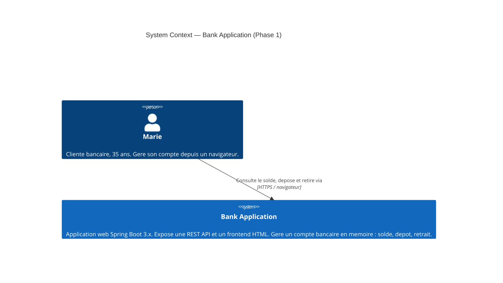
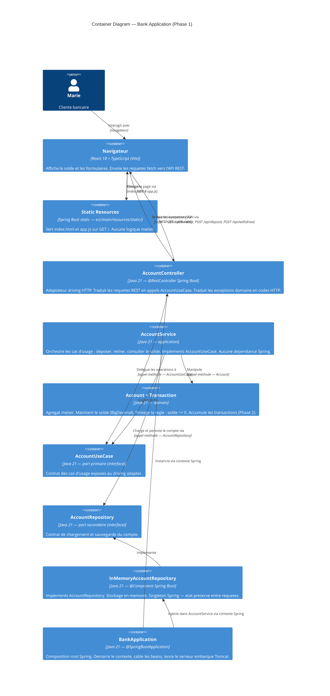

# Architecture Brief — Bank Application

**Projet** : Bank Application — Software Crafts Romandie  
**Date** : 2026-06-02  
**Architecte** : Morgan (solution-architect nWave)  
**Statut** : Approuvé — prêt pour DISTILL wave

---

## Application Architecture

> **Pivot 2026-06-02** : La section ci-dessous remplace l'architecture CLI kata. Le projet est
> désormais une application web bancaire standard. Les décisions CLIAdapter et "Java pur sans
> framework" sont remplacées par Spring Boot 3.x et AccountController (@RestController).

---

### Contexte système

La Bank Application est une application web bancaire standard. Marie, cliente bancaire grand
public, interagit depuis son navigateur pour consulter son solde, effectuer des dépôts et des
retraits. Le backend expose une REST API (Spring Boot 3.x) consommée par un frontend React 18
servi par le même serveur. Il n'y a aucune dépendance externe (pas de base de données
Phase 1, pas d'API tierce). Le compte est maintenu en mémoire (in-process, singleton Spring).

---

### Attributs de qualité prioritaires

| Attribut | Priorité | Justification |
|----------|----------|---------------|
| Testabilité | Critique | Isolation domaine / HTTP — le domaine doit être testable sans Spring ; l'API REST testable via MockMvc sans serveur complet |
| Maintenabilité | Élevée | Phase 2 ajoutera l'historique des transactions sans toucher le domaine ni l'API actuelle |
| Time-to-market | Élevée | Stack standard Spring Boot — outillage, documentation, exemples abondants |
| Sécurité | Non critique (Phase 1) | Pas d'authentification en Phase 1 — décision explicite documentée dans ADR-003 |
| Performance | Non critique | Application mono-utilisateur en mémoire — latence imperceptible |

---

### Diagramme C4 — Niveau 1 : System Context



---

### Diagramme C4 — Niveau 2 : Container



---

### Architecture retenue : Hexagonal (Ports & Adapters) + OOP + Spring Boot

**Justification** : L'architecture Hexagonale est confirmée et renforcée par le pivot web.
Le risque de pollution Spring dans le domaine (annotations `@Autowired`, `@Component` dans
`domain/`) est plus élevé avec Spring Boot qu'avec Java pur — c'est précisément pourquoi
la règle de dépendance hexagonale et l'enforcement ArchUnit deviennent critiques.

**Règle de dépendance** : toutes les dépendances pointent vers l'intérieur.
- `AccountController` (@RestController) → `AccountUseCase` (port primaire)
- `AccountService` → `AccountRepository` (port secondaire)
- `InMemoryAccountRepository` (@Component) implémente `AccountRepository`
- `Account` et `Transaction` ne dépendent d'aucun port, d'aucun adaptateur, d'aucune classe Spring
- Le package `domain` n'importe **jamais** `org.springframework.*`

---

### Decomposition des composants

| Composant | Couche | Responsabilité unique |
|-----------|--------|-----------------------|
| `Account` | domain | Agrégat — maintient le solde (`BigDecimal`), valide les opérations, lève `InsufficientFundsException`, accumule les transactions |
| `Transaction` | domain | Value object (Java Record) — type (DEPOSIT/WITHDRAWAL) + montant + horodatage |
| `InsufficientFundsException` | domain | Exception métier non-checked — signal de violation de règle domaine |
| `AccountUseCase` | application/port/in | Port primaire (interface driving) — contrat des cas d'usage exposés au controller HTTP |
| `AccountRepository` | application/port/out | Port secondaire (interface driven) — contrat de chargement/sauvegarde du compte |
| `AccountService` | application | Implémentation de `AccountUseCase` — orchestre domain + port secondaire — aucune dépendance Spring |
| `AccountController` | adapter/in/web | Adaptateur driving HTTP (@RestController) — traduit REST en appels `AccountUseCase`, traduit exceptions domaine en codes HTTP |
| `DepositRequest` | adapter/in/web | DTO entrant (Java Record) — montant du dépôt |
| `WithdrawRequest` | adapter/in/web | DTO entrant (Java Record) — montant du retrait |
| `BalanceResponse` | adapter/in/web | DTO sortant (Java Record) — solde courant formaté |
| `InMemoryAccountRepository` | adapter/out | Adaptateur driven (@Component, singleton Spring) — implémente `AccountRepository` en mémoire |
| `BankApplication` | composition root | @SpringBootApplication — démarre le contexte Spring, câble les beans |
| `frontend/` (build → `static/`) | static resources | Projet Vite + React 18 + TypeScript — `api/bankApi.ts`, `BalanceDisplay`, `OperationForm`, `App`. Tests Vitest + RTL. Build Maven → `src/main/resources/static/` |

---

### Ports driving (primaires)

**`AccountUseCase`** — interface Java, couche `application/port/in`

Contrat comportemental (sans signature de méthode — HOW appartient au crafter) :
- Déposer un montant positif sur le compte → met à jour le solde
- Retirer un montant positif si les fonds sont suffisants → met à jour le solde, ou signale l'insuffisance
- Consulter le solde courant → retourne la valeur actuelle sans la modifier

**`AccountController`** (@RestController) — adaptateur driving HTTP, couche `adapter/in/web`

Endpoints REST exposés :
- `GET /api/balance` → consulter le solde courant
- `POST /api/deposit` → déposer un montant (`DepositRequest` body JSON)
- `POST /api/withdraw` → retirer un montant (`WithdrawRequest` body JSON)

Codes HTTP :
- `200 OK` — opération réussie
- `400 Bad Request` — montant invalide (<= 0 ou non numérique)
- `409 Conflict` — fonds insuffisants (traduit depuis `InsufficientFundsException` domaine)

---

### Ports driven (secondaires)

**`AccountRepository`** — interface Java, couche `application/port/out`

Contrat comportemental :
- Charger le compte courant (unique pour la Phase 1)
- Sauvegarder l'état du compte après chaque opération

**`InMemoryAccountRepository`** — adaptateur driven, couche `adapter/out`

Annoté `@Component` Spring Boot : singleton géré par le conteneur IoC. L'état du compte est
préservé entre les requêtes HTTP pour la durée de vie du processus. Redémarrer le serveur remet
le solde à zéro (comportement documenté en Phase 1).

**Probe du port driven** (principe Earned Trust) :
L'`InMemoryAccountRepository` expose une méthode `probe()` exécutée au démarrage via
`ApplicationRunner` Spring. La probe valide : création d'un compte en mémoire, chargement,
mutation, rechargement cohérent. Échec → le contexte Spring refuse de démarrer avec un événement
structuré `health.startup.refused`. Justification : même un adaptateur en mémoire peut régresser
entre refactors ; la probe détecte les ruptures de contrat avant toute requête HTTP.

---

### Structure des packages Java

```
src/
  main/java/
    com/softcrafts/bankkata/
      domain/
        Account.java                    (agregat)
        Transaction.java                (value object — record Java)
        InsufficientFundsException.java (exception metier)
      application/
        port/
          in/  AccountUseCase.java      (port primaire — interface)
          out/ AccountRepository.java   (port secondaire — interface)
        AccountService.java             (implementation AccountUseCase — aucune dependance Spring)
      adapter/
        in/
          web/
            AccountController.java      (@RestController)
            DepositRequest.java         (record — DTO entrant)
            WithdrawRequest.java        (record — DTO entrant)
            BalanceResponse.java        (record — DTO sortant)
        out/
          InMemoryAccountRepository.java  (@Component — singleton Spring)
      BankApplication.java              (@SpringBootApplication — remplace Main)
  main/resources/
    static/
      index.html                        (frontend HTML vanilla)
      app.js                            (fetch API — consomme REST)
  test/java/
    com/softcrafts/bankkata/
      domain/
        AccountTest.java
      application/
        AccountServiceTest.java
      adapter/
        in/web/
          AccountControllerTest.java    (MockMvc — sans serveur complet)
        out/
          InMemoryAccountRepositoryTest.java
```

---

### Stack technologique

| Composant | Choix | Version | Licence | Justification |
|-----------|-------|---------|---------|---------------|
| Runtime | Java | 21 LTS | GPL v2 + Classpath Exception | Inchangé — LTS jusqu'à 2031, Records natifs |
| Framework web | Spring Boot | 3.x | Apache 2.0 | Standard industrie, REST natif (@RestController), injection de dépendances (composition root Spring), Tomcat embarqué |
| Tests REST | MockMvc | Spring Boot Starter Test | Apache 2.0 | Tests d'intégration REST sans démarrer un serveur complet — isolation HTTP rapide |
| Tests unitaires | JUnit 5 | 5.x | EPL 2.0 | Standard de facto Java |
| Assertions | AssertJ | 3.x | Apache 2.0 | Assertions fluides |
| Mocking | Mockito | 5.x | MIT | Isolation des ports driven pour tests unitaires |
| Build | Maven ou Gradle | dernière stable | Apache 2.0 | Standard Java — choix laissé au crafter |
| Frontend | React 18 + TypeScript | Vite 5.x | MIT | Standard industriel — projet `frontend/` autonome, proxy dev → :8080, build produit dans `src/main/resources/static/`, tests Vitest + RTL |
| Enforcement architectural | ArchUnit | 1.x | Apache 2.0 | Vérifie les règles de dépendance hexagonale ET l'absence d'imports Spring dans le domaine |

**Intégrations externes** : aucune — pas d'annotation de contract testing requise.

---

### Enforcement architectural (ArchUnit)

Règles à encoder en CI via ArchUnit :
1. Les classes du package `domain` n'importent aucune classe des packages `application`, `adapter`
2. Les classes du package `domain` n'importent **aucune** classe `org.springframework.*` (guardrail pivot)
3. Les classes du package `application` n'importent aucune classe du package `adapter`
4. Les classes du package `application` n'importent aucune classe `org.springframework.*`
5. Seul `BankApplication` (composition root) est annoté `@SpringBootApplication`
6. Les classes `@RestController` appartiennent uniquement au package `adapter.in.web`

---

### Analyse de réutilisation (Reuse Analysis)

| Composant existant (CLI original) | Fichier | Overlap | Decision | Justification |
|---|---|---|---|---|
| `Account` | `domain/Account.java` | Logique domaine | REUSE AS-IS | La règle "solde >= 0" est indépendante du transport |
| `Transaction` | `domain/Transaction.java` | Value object | REUSE AS-IS | Record immuable, indépendant du transport |
| `InsufficientFundsException` | `domain/` | Exception domaine | REUSE AS-IS | Exception métier pure |
| `AccountUseCase` | `application/port/in/` | Port primaire | REUSE AS-IS | Spring Boot injecte l'implémentation via l'interface |
| `AccountRepository` | `application/port/out/` | Port secondaire | REUSE AS-IS | Interface indépendante du framework |
| `AccountService` | `application/` | Orchestration | REUSE AS-IS | Aucune dépendance CLI ni Spring dans le service |
| `InMemoryAccountRepository` | `adapter/out/` | Stockage mémoire | EXTEND (bean Spring) | Ajouter `@Component` pour l'injection Spring, singleton géré par le conteneur |
| `CLIAdapter` | `adapter/in/` | Driving port CLI | **REMOVE** | Remplacé par `AccountController` (@RestController) |
| `Main` | `Main.java` | Point d'entrée | **REPLACE** | `@SpringBootApplication` remplace le `main()` manuel |
| `AccountController` | `adapter/in/web/` | Driving port HTTP | CREATE NEW | Nouveau composant — pas d'équivalent dans le CLI original |
| `DepositRequest` | `adapter/in/web/` | DTO entrant | CREATE NEW | Nouveau — spécifique au transport HTTP |
| `WithdrawRequest` | `adapter/in/web/` | DTO entrant | CREATE NEW | Nouveau — spécifique au transport HTTP |
| `BalanceResponse` | `adapter/in/web/` | DTO sortant | CREATE NEW | Nouveau — spécifique au transport HTTP |
| `index.html` + `app.js` | `resources/static/` | Frontend | CREATE NEW | Nouveau — interface utilisateur web |

---

### Stratégie de qualité (ISO 25010)

| Attribut | Stratégie |
|----------|-----------|
| Testabilité | Domaine testable sans Spring (aucune annotation) ; API REST testable via MockMvc sans démarrer Tomcat ; ports driving/driven permettent le mock de tout adaptateur |
| Maintenabilité | Phase 2 ajoute `StatementService` et un endpoint `/api/statement` sans modifier `Account`, `AccountService` ni `AccountController` |
| Fiabilité | `InsufficientFundsException` = signal explicite non-checked — aucun état corrompu possible ; probe au démarrage détecte les régressions de l'adaptateur mémoire |
| Sécurité | Pas d'authentification Phase 1 (décision explicite ADR-003) — aucune donnée persistée |
| Utilisabilité | Feedback immédiat après chaque opération (confirmation + solde mis à jour inline) — confirmé dans le JTBD DISCUSS |

---

### Questions ouvertes — Pour DISTILL / DELIVER

| # | Question | Impacte |
|---|----------|---------|
| Q1 | Format JSON des réponses d'erreur (RFC 7807 Problem Details ?) | Contrat API frontend/backend — doit être stable avant implémentation |
| Q2 | Code HTTP pour fonds insuffisants (409 Conflict vs 422 Unprocessable Entity) | Sémantique REST — confirmé 409 dans le DISCUSS, à valider en DISTILL |
| Q3 | Sérialisation BigDecimal en JSON (String vs Number) | Cohérence frontend/backend — `"150.00"` vs `150.00` |
| Q4 | CORS si frontend servi sur un port différent | Hors scope Phase 1 — Spring Boot sert le HTML depuis static resources |
| Q5 | Authentification et gestion des sessions | Hors scope Phase 1 — à traiter en Phase 3 |

---

### ADRs associés

| ADR | Titre | Statut |
|-----|-------|--------|
| [ADR-001](adr-001-hexagonal-oop.md) | Architecture Hexagonale + OOP | Accepté — confirmé et renforcé (pivot web) |
| [ADR-002](adr-002-java21.md) | Java 21 LTS | Accepté — inchangé |
| [ADR-003](adr-003-spring-boot.md) | Spring Boot 3.x comme framework web | Accepté — nouveau (pivot 2026-06-02) |
